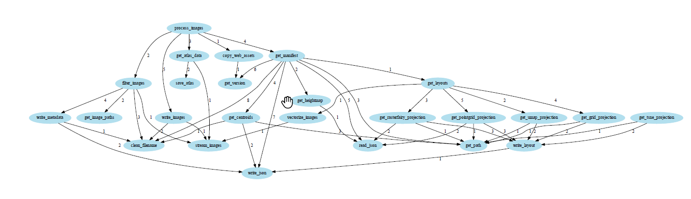

# Auto-Documentor
Automatic Documentation of Python code

This project aims to converts the python code into Dataflow diagram, Flow chart and generate automatic README.md files. However the currently implemented code works only for the Dataflow diagram. I will update this and keep adding more features.

`usage`
`python documentor.py your_file.py`

`Requirement: pip install graphviz`

I have used the `pixplot.py` from this Pixplot repository
[link](https://github.com/YaleDHLab/pix-plot)
### Pixplot Dataflow diagram
 
